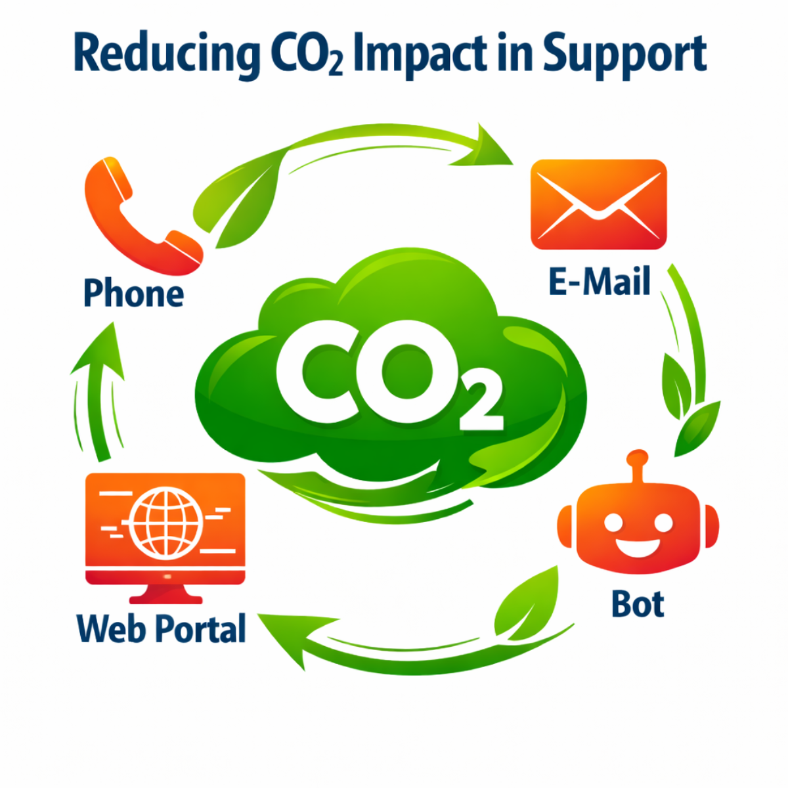

# Customer Service CO2

Open-source framework for estimating the operational CO2 impact of customer service workflows.

This project combines standard customer service reporting with an estimated CO2 layer across:

- calls
- email
- chatbots
- voice bots
- case handling
- root causes behind contact demand

The goal is not just to show which channel is expensive.
The goal is to show where avoidable digital load is created, which contact drivers are preventable, and how service operations can reduce both friction and impact.

## Contents

- [What This Is](#what-this-is)
- [What This Is Not](#what-this-is-not)
- [Product Idea](#product-idea)
- [Model Architecture](#model-architecture)
- [Demo](#demo)
- [Repository Structure](#repository-structure)
- [Getting Started](#getting-started)
- [Recommended MVP Scope](#recommended-mvp-scope)
- [Current Status](#current-status)
- [Suggested Next Steps](#suggested-next-steps)
- [Disclaimer](#disclaimer)

## What This Is

This repository is a reference implementation for:

- a canonical data model for customer service sustainability measurement
- activity-based CO2 estimation logic
- adapter and connector design for external systems
- a reference dashboard demo
- implementation guidance for teams adopting the model

It is designed to work with:

- CSV exports
- API integrations
- warehouse data
- event-level service records

## What This Is Not

This project is not:

- a certified carbon accounting system
- a plug-and-play integration for every CRM or CCaaS platform
- a replacement for formal regulatory or financial emissions reporting

It should be understood as:

- estimated operational CO2 impact
- activity-based measurement
- assumption-aware analytics

Preferred wording when presenting results:

- `estimated operational CO2 impact`
- `activity-based estimate`
- `assumption-based estimate`
- `confidence level`

Avoid claiming:

- exact emissions
- certified footprint
- formal emissions reporting readiness

See: [claims-and-disclaimers.md](./docs/methodology/claims-and-disclaimers.md)

## Product Idea

Most customer service teams already report:

- contact volume
- AHT
- FCR
- reopen rate
- bot containment
- callback performance

This project adds:

- `estimated CO2e per call`
- `estimated CO2e per email`
- `estimated CO2e from queue time`
- `estimated CO2e from reopened cases`
- `estimated CO2e avoided by bot deflection`
- `estimated CO2e from preventable contact drivers`

The strongest product angle is not only channel comparison.
It is root-cause visibility:

- why customers contact support
- which contact drivers are preventable
- which teams and channels absorb avoidable demand

## Model Architecture

### Three-layer structure

The repository is structured in three layers of increasing strictness:

**Layer 1 - Operational CS model** (the calculator and demo)

The canonical data model captures operational facts: cases, interactions, calls, emails, bot sessions, attachments, callbacks, transfers, escalations, agent activity, and contact drivers.

The calculator sits on top of that model. It takes operational inputs plus an `assumption_set` and produces channel CO2 metrics, workforce CO2 metrics, and root-cause CO2 metrics.

This is the right layer for: operational dashboards, KPI storytelling, and benchmarking.

**Layer 2 - Stricter THG accounting extension** (optional upgrade path)

When operational estimates are no longer sufficient - for example when formal auditability, Scope 1/2/3 separation, or GHG Protocol alignment is required - the operational model can be extended into a stricter greenhouse-gas data structure.

This extension separates:

- activity records from emission factors
- gas-specific GWP values from CO2e totals
- source references from calculated results

This layer is a target structure for stricter reporting. The schema that describes how to structure it is:

- [final-thg-data-schema-v0.1.md](./docs/schemas/final-thg-data-schema-v0.1.md)

### Core concepts

**Canonical service model**

The repository defines a shared model for:

- `case`
- `interaction`
- `call_interaction`
- `email_interaction`
- `chat_session`
- `bot_session`
- `voice_bot_session`
- `attachment`
- `callback`
- `transfer`
- `escalation`
- `agent_activity`
- `contact_driver`

**Activity-based CO2 estimation**

The core logic is:

`CO2e = energy use (kWh) x electricity carbon factor`

Energy use is estimated from:

- device time
- network traffic
- cloud / AI usage
- service handling time

**Root-cause analysis**

The model supports:

- source contact labels
- normalized driver groups
- preventability flags
- driver group x channel views
- driver group x team views

This is how the project moves beyond a simple channel dashboard.

**Workforce context**

Workforce is modeled as an advanced layer through:

- active agents
- productive hours
- occupancy
- channel allocation
- CO2e per agent
- CO2e per productive hour

## Demo

Reference dashboard:

- [demo-dashboard.html](./demo/demo-dashboard.html)
- [demo-calculator-v2.html](./demo/demo-calculator-v2.html)

Supporting demo data:

- [sample-output-metrics.json](./data/demo/sample-output-metrics.json)
- [sample-dataset-v0.1.json](./data/demo/sample-dataset-v0.1.json)

### Demo Versions

| Version | File | Purpose |
|---------|------|---------|
| V1 | `demo-dashboard.html` | Static output demo - discuss the product story, KPI framing, and output structure |
| V2 | `demo-calculator-v2.html` | Interactive calculator - live CO2 calculation from monthly inputs with editable assumptions |

The demos are not production calculators. They make the model tangible and testable.

The supporting data files also serve different roles:

- `sample-output-metrics.json` is the pre-calculated output used by the static `V1` dashboard demo.
- `sample-dataset-v0.1.json` is a canonical sample dataset for schema and mapping discussion.
- `V2` does not import either file at runtime. It calculates from its own editable demo-state inputs in the browser.

**No real baseline comparison exists.** The calculator includes a `baseline_comparison` output block, but the baseline values are simulated - hardcoded offsets applied to the current period to create a plausible "before" picture for demo purposes. There is no second dataset, no historical period, and no real delta. Do not present the baseline delta figures as measured improvement.

Use the calculators to:

- show how assumptions change results
- compare reporting boundaries
- demonstrate how one channel or driver affects total estimated CO2e
- discuss which inputs a real implementation would need

`V2` also supports `Export Input JSON` and `Import Input JSON` for demo scenario roundtrips.
Use them to save the current calculator input state and reload it later or share it with another reviewer.
This input JSON is a demo-state format, not a stable external import schema or production integration interface.
`Export Output JSON` is intended for inspection and discussion, not for re-import as `Input JSON`.

#### Production use note

`V2` should be read as two separate things:

- a reference implementation of the calculation logic and output shape
- a demo UI for exploring assumptions, inputs, and result storytelling

For production use, keep the calculation logic but replace the demo shell around it:

- move the calculator logic into a clearly versioned application module or service
- replace demo-state imports and exports with a stable input contract, validation, persistence, and audited source mappings
- replace the simulated baseline with real historical periods or an explicitly modeled scenario framework
- treat the current single-file demo UI as a prototype, not as the recommended production frontend structure

The current impact values should always be presented as `estimated operational CO2 impact`.
They are assumption-based operational estimates for decision support, not certified emissions accounting.

#### Technical note for developers

The current `V2` demo intentionally favors portability and inspectability over frontend modularity.
Today, the demo keeps markup, styling, UI state, and an inline copy of the calculator logic in a single HTML file so it can be opened and reviewed as a self-contained artifact.

At the same time, the calculation core also exists separately in `src/`.
This means the current demo implementation contains duplication by design for demo convenience, not because duplication is the recommended product architecture.

This is acceptable for a reference demo, but it is fragile for product use because:

- UI structure and calculation logic are not cleanly separated
- styling, rendering, state management, and import/export behavior are tightly coupled
- changes to the inline HTML script can affect test harnesses that currently inspect the demo file directly

If `V2` is carried forward into a product, the hardening path should be:

- use the `src/` calculator module as the single source of truth
- move CSS out of the HTML file
- split the large UI into section-level templates or components
- separate calculation, validation, persistence, rendering, and import/export responsibilities

If you are reading the repository to understand how `V2` works technically, use this order:

1. [src/demo-calculator-v2.js](./src/demo-calculator-v2.js) for the extracted calculation core, default state shape, and output contract
2. [demo/demo-calculator-v2.html](./demo/demo-calculator-v2.html) for the current self-contained demo UI, including the inline demo copy of the calculator logic
3. [scripts/calculator-tests/](./scripts/calculator-tests/) for the current validation approach and the remaining HTML-vs-`src/` coupling

Current implementation caveat:

- `src/demo-calculator-v2.js` is the clearest entry point if you want to understand the calculator itself
- `demo/demo-calculator-v2.html` is the clearest entry point if you want to understand the current demo wiring and UI behavior
- several tests still extract the inline HTML calculator at runtime, and the parity test checks that it still matches `src/demo-calculator-v2.js`

### What the demo data represents

The sample dataset models a fictional German customer service operation ("Demo Support GmbH").
It uses a German electricity grid factor (0.363 kg CO2e / kWh) and German-market defaults throughout.

This matters because all calculator defaults - device power, network intensity, LLM energy, storage - are tied to this assumption set.
The demo is not a neutral baseline. It is a concrete example with a specific geography and a specific starting assumption profile.

To understand which defaults are strong references and which should be replaced for real use, see:

- [assumptions-and-evidence.md](./docs/methodology/assumptions-and-evidence.md)

That document rates each assumption as green (well supported), yellow (plausible for demo use), or red (replace before serious deployment).

The demo is structured around:

1. `Overview`
2. `Root Causes`
3. `Channels`
4. `Advanced Workforce`
5. `Methodology`

For the detailed methodology behind the demo calculator, see:

- [CO2 Mapping](./docs/methodology/co2-mapping.md)
- [Assumptions And Evidence](./docs/methodology/assumptions-and-evidence.md)

### Interpreting calculator inputs

Some demo-calculator fields are intentionally simplified and should be read as operational modeling inputs, not as exact source-system fields.

Important examples:

- `callback retries` in `Calls` are modeled as extra operational load outside the normal `resolved calls` flow
- `email body size` is the small base payload of an email without major attachments
- `attachment transfer` is the total file volume transmitted during the reporting period
- `stored email or attachment` is retained data volume over time, used for storage-related footprint
- `workforce` and `root causes` are derived KPI and attribution layers, not raw channel-footprint inputs

The calculator should therefore be read as an assumption-aware operational model, not as a literal copy of one vendor export.

### Why it must be adapted for each company

The demo defaults are useful starting assumptions.
They are not universal truth.

A real company implementation should adapt at least:

- electricity grid factors by country, market, or cloud region
- device assumptions for agent and customer environments
- network assumptions for fixed versus mobile usage
- AI assumptions for model class, prompt length, and turn count
- reporting boundary: provider-side only or provider plus customer interaction
- channel semantics from the source systems
- contact-driver taxonomy and preventability rules
- staffing and workforce structure

This matters because two companies can both report `100,000 calls`, but have very different:

- telephony setup
- queue design
- callback behavior
- attachment volume
- bot quality
- handover rate
- infrastructure region

The model is therefore `portable`, but not `plug-and-play`.
Each company needs its own mapping, assumptions, and calibration before the outputs should be treated as decision-grade internal metrics.

**A universal plug-and-play tool is not the goal - and would not be meaningful.**

CO2e estimates are assumption-driven by nature. Every output value depends on choices about grid carbon intensity, device power, network load, AI energy use, and what counts as in-scope. A tool that hides those choices does not produce more accurate results. It produces less honest ones.

The value of this framework is not a single number. It is a reproducible method with explicit, replaceable assumptions. That makes it possible to compare results across time within the same organisation, to understand what changed and why, and to improve the model as better data becomes available.

A company that switches to renewable energy, reduces average handling time, or improves bot containment should be able to see that in the model - not because a global benchmark said so, but because the assumptions and inputs changed in a documented way.

For a traffic-light view of which defaults are strong references and which are only starting assumptions, see:

- [Assumptions And Evidence](./docs/methodology/assumptions-and-evidence.md)

---

## Repository Structure

All folders and their contents.

## assets/

Static visual assets used in documentation and demos.

| File | Purpose |
|---|---|
| [co2.png](./assets/co2.png) | Project logo, used in the README header and demo pages. |
| [mermaid-diagram.png](./assets/mermaid-diagram.png) | Flowchart showing the avoidable demand chain. |

---

## data/

Three subfolders with different roles: sample data for the demos, reference tables for emission factors, and CSV templates for real data input.

```
data/
├── demo/        sample datasets for running and testing the demo
├── reference/   emission factors, GWP values, and literature sources
└── templates/   CSV input templates per channel
```

### data/demo/

| File | Purpose |
|---|---|
| [sample-dataset-v0.1.json](./data/demo/sample-dataset-v0.1.json) | Sample canonical dataset for a fictional German customer service operation ("Demo Support GmbH"). Populates the canonical schema entities: organizations, cases, interactions, bot sessions, agent activity, and contact drivers. |
| [sample-output-metrics.json](./data/demo/sample-output-metrics.json) | Pre-calculated output metrics derived from the sample dataset. Used by the static dashboard demo to display KPI cards, CO2 estimates, and channel breakdowns without running live calculations. |

### data/reference/

Reference material for greenhouse-gas factor and source modeling.

The starting point are the two Excel workbooks. They contain the emission factor assumptions and GWP values in readable form and are the simpler entry point for understanding the model's underlying numbers:

| File | Description |
|---|---|
| [carbon_footprint_ict_quellen.xlsx](./data/reference/carbon_footprint_ict_quellen.xlsx) | German version of the ICT carbon footprint source workbook. |
| [carbon_footprint_ict_sources_en.xlsx](./data/reference/carbon_footprint_ict_sources_en.xlsx) | English version of the same workbook. |

These files are not a complete emissions inventory. To produce one, they still need to be joined with actual company activity data: consumption quantities, site and reporting period, data quality flags, and reporting boundary definition.

For the stricter target schema that can organize those factors, gas rules, and source references alongside company activity data, see [final-thg-data-schema-v0.1.md](./docs/schemas/final-thg-data-schema-v0.1.md).

### data/templates/

CSV input templates for the CSV-first adoption path. Each template includes sample rows and covers the minimum required fields for its channel as defined in [data-requirements-by-channel.md](./docs/integration/data-requirements-by-channel.md).

All channel templates share a common set of dimension fields: `period_start`, `period_end`, `team_id`, `country`, `channel`, and `contact_driver_group`. Rows are one record per team, queue, and period.

The current template set is intentionally aligned to the recommended first implementation scope:

- `calls`
- `email`
- `chatbot`
- normalized `contact_driver_group`

There are currently no separate CSV-first templates for `voice_bot`, standalone `workforce`, or dedicated root-cause detail tables. Those areas are better treated as later-phase extensions after the first channel mapping is working.

**[csv-template-calls.csv](./data/templates/csv-template-calls.csv)**

```
period_start, period_end, team_id, queue_id, country, channel,
contacts, resolved_cases,
avg_handle_time_seconds, avg_queue_time_seconds, avg_hold_time_seconds, callback_retry_attempts,
active_agent_count, scheduled_hours, productive_hours,
contact_driver_group
```

**[csv-template-emails.csv](./data/templates/csv-template-emails.csv)**

```
period_start, period_end, team_id, queue_id, country, channel,
contacts, resolved_cases, reopened_cases,
avg_handle_time_seconds, attachments_sent, attachment_total_gb,
active_agent_count, scheduled_hours, productive_hours,
contact_driver_group
```

**[csv-template-chatbot.csv](./data/templates/csv-template-chatbot.csv)**

```
period_start, period_end, team_id, country, channel,
contacts, bot_resolved_sessions, bot_escalated_sessions, avg_turn_count,
active_agent_count, scheduled_hours, productive_hours,
contact_driver_group
```

**[csv-template-thg-source-catalog.csv](./data/templates/csv-template-thg-source-catalog.csv)**

Template for documenting emission factor sources, aligned with the `SourceReference` entity in the THG schema.

```
source_reference_id, source_type, publisher_or_owner, title, year, language, geography,
source_role, artifact_type, access_path, notes, status
```

Pre-filled with example rows for the IPCC AR6 GWP table, GHG Protocol Corporate Standard, GHG Protocol Scope 2 Guidance, and the local reference workbook.

---

## docs/

The `docs/` folder is organized into six subfolders that form a layered documentation chain - from conceptual foundation through data model, integration, system design, product specification, and validation.

```
docs/
├── methodology/     conceptual model, assumptions, claims, CO2 mapping, root-cause taxonomy
├── schemas/         data model definitions, KPI formulas, TypeScript types, THG extension
├── integration/     adoption guide, adapter mapping, connector SDK, per-channel data requirements
├── architecture/    system architecture, package structure, workforce modeling
├── product/         dashboard specification, product narrative and storyboard
└── testing/         test matrix, manual checklist, generated test summary
```

Each layer depends on the one above it. Changes to methodology affect schemas. Changes to schemas affect integration and architecture. The product and testing layers consume the output of everything above them.

---

### methodology/

The conceptual foundation of the project. Defines what the model is, what it assumes, what it can claim, and how activity data maps to CO2 metrics.

| File | Purpose |
|---|---|
| [customer-service-co2-model.md](./docs/methodology/customer-service-co2-model.md) | Core model. Defines the central formula `CO2e = kWh × grid factor`, reporting boundaries (provider-side vs. interaction footprint), per-channel calculation logic, device and network defaults, LLM energy assumptions, and five detailed worked examples (AHT reduction, reopen avoidance, email reduction, chatbot deflection, chatbot vs. email comparison). |
| [co2-mapping.md](./docs/methodology/co2-mapping.md) | Translation layer. Maps operational activity data to named CO2 metrics for each channel. Defines metrics like `co2e_per_call_g`, `co2e_from_queue_time_kg`, `co2e_from_reopened_email_cases_kg`, `net_avoided_co2e_kg`, and root-cause attribution metrics. |
| [assumptions-and-evidence.md](./docs/methodology/assumptions-and-evidence.md) | Assumption quality ratings. Classifies each default value as green (well-supported, keep), yellow (plausible for MVP, plan to calibrate), or red (replace before serious deployment). Sources include Umweltbundesamt, EPA eGRID, Epoch AI. |
| [claims-and-disclaimers.md](./docs/methodology/claims-and-disclaimers.md) | Defines what the model can and cannot credibly claim. Separates safe claims, claims needing qualification, and claims to avoid. Includes ready-to-use UI disclaimer texts and confidence level descriptions. |
| [contact-driver-taxonomy.md](./docs/methodology/contact-driver-taxonomy.md) | Root-cause classification model. Defines a two-layer approach: company-specific source labels mapped to normalized driver groups. Includes `is_preventable` and `journey_stage` flags, a minimum eight-group MVP taxonomy, and recommended reporting views by driver group, channel, and team. |

---

### schemas/

Data model definitions. Describes what fields exist, how they relate, how KPIs are calculated, and how the operational model extends into formal greenhouse-gas accounting.

| File | Purpose |
|---|---|
| [canonical-schema-v0.1.md](./docs/schemas/canonical-schema-v0.1.md) | The foundational data model. Defines 19 core entities (Case, Interaction, CallInteraction, EmailInteraction, ChatSession, BotSession, VoiceBotSession, Attachment, Callback, Transfer, Escalation, AgentActivity, ContactDriver, AssumptionSet, and others), standard enums, naming rules, validation constraints, and example JSON records. All integration and architecture documents build on this schema. |
| [customer-service-kpi-schema.md](./docs/schemas/customer-service-kpi-schema.md) | KPI and formula layer. Defines three tiers: raw inputs, operational KPIs (FCR, reopen rate, AHT, bot containment, occupancy, etc.), and CO2 KPIs with explicit formulas per channel. Includes a star-schema recommendation and an MVP minimum field set. |
| [final-thg-data-schema-v0.1.md](./docs/schemas/final-thg-data-schema-v0.1.md) | Strict GHG accounting extension. For use when auditability, Scope 1/2/3 separation, or GHG Protocol alignment is required. Adds ReportingBoundary, ActivityRecord, EmissionFactor, GasFactor, DataQualityRecord, and SourceReference entities as a target structure for stricter reporting. |
| [typescript-types-v0.1.ts](./docs/schemas/typescript-types-v0.1.ts) | TypeScript type definitions for the canonical schema. |

**Schema hierarchy:** `canonical-schema` is the base. `customer-service-kpi-schema` adds calculation logic on top. `final-thg-data-schema` is a stricter accounting extension that can sit alongside or above the operational layer.

---

### integration/

Practical adoption guidance. Covers how to bring external data into the canonical model, how connectors are structured, and what minimum data each channel requires.

| File | Purpose |
|---|---|
| [implementation-guide.md](./docs/integration/implementation-guide.md) | 10-step adoption path. Covers three modes: CSV-first (pilots, non-engineering teams), event-level (richer operational analysis), and warehouse-first (enterprise analytics teams). Includes scope definition, assumption setup, validation steps, baseline guidance, and scenario examples for small teams, call centers, and digital-first orgs. |
| [adapter-mapping-guide.md](./docs/integration/adapter-mapping-guide.md) | Source system normalization guide. Covers how to map Zendesk, Salesforce, Genesys, Asterisk/3CX, and CSV exports to the canonical schema. Defines mapping modes (event-level vs. aggregated fallback), confidence levels per field (high/medium/low), and how to handle ambiguous or missing fields. |
| [connector-sdk-interface.md](./docs/integration/connector-sdk-interface.md) | Connector contract. Defines the 7-stage connector lifecycle (describe → configure → extract → map → validate → publish → report), TypeScript interfaces for all stages, connector run reporting, and three maturity levels (experimental, beta, stable). |
| [data-requirements-by-channel.md](./docs/integration/data-requirements-by-channel.md) | Minimum data fields per channel. Covers calls, emails, human chat, chatbot, voice bot, attachments, and knowledge/self-service. Separates required fields from recommended fields and defines data quality grades A through D. |

---

### architecture/

System-level design documents. Defines how the open-source project is structured as packages, and how workforce is modeled as an analytical layer.

| File | Purpose |
|---|---|
| [open-source-architecture-spec.md](./docs/architecture/open-source-architecture-spec.md) | Full system architecture. Defines four packages: `core-model` (schema, entities, validation, assumption registry), `core-engine` (KPI and CO2 calculations, confidence scoring, aggregation), `connectors` (SDK plus reference adapters for Zendesk, Salesforce, Genesys, Asterisk), and `app` (API, UI, setup wizard, dashboard). Covers three ingestion modes and a confidence scoring model. |
| [workforce-operating-model.md](./docs/architecture/workforce-operating-model.md) | Workforce modeling extension. Defines a four-layer model: organization structure (Agent, Team, Queue), channel allocation (blended agent percentages by period), time and productivity (scheduled hours, occupancy, shrinkage, device type, work mode), and contact-driver fit (which driver groups each team absorbs). Privacy recommendation: team-level by default, not mandatory person-level tracking. |

---

### product/

Product definition and narrative. Describes the dashboard structure and the story it should tell.

| File | Purpose |
|---|---|
| [demo-dashboard-spec.md](./docs/product/demo-dashboard-spec.md) | 9-page dashboard specification: Overview, Calls, Email, Chatbot, Voice Bot, Cases, Workforce, Root Causes, Methodology. Defines all KPI cards, charts, drilldowns, and baseline comparison behavior per page. Visual direction: operational and analytic, not greenwashed. |
| [demo-storyboard.md](./docs/product/demo-storyboard.md) | Product narrative and information hierarchy. Defines the four-part product story, hero metrics, five core use cases, and recommended click path. Describes what a viewer should take away: not a greener dashboard, but a system for seeing where demand, staffing, and contact causes create avoidable digital load. |

`demo-storyboard.md` is the why behind `demo-dashboard-spec.md`. Read the storyboard first if you are evaluating whether the product framing fits your use case.

---

### testing/

Validation coverage for the demo calculator.

| File | Purpose |
|---|---|
| [calculator-test-matrix.md](./docs/testing/calculator-test-matrix.md) | Structured test plan. Covers all calculator sections (assumptions, calls, email, chatbot, voice bot, cases, workforce, root causes) with directional behavior tests, cross-section scenarios, and intentionally invalid states to verify correct handling. |
| [calculator-cs-manual-checklist.md](./docs/testing/calculator-cs-manual-checklist.md) | Manual smoke test checklist for a non-technical CS or operations person. Eight priority levels from basic UI behavior through boundary comparison, per-channel inputs, and six named good-scenario sets. |
| [calculator-test-summary.md](./docs/testing/calculator-test-summary.md) | Generated test results summary. Covers HTML-vs-src parity checks, single-field regression, pairwise checks, logic checks, edge cases, monotonicity, realistic scenarios, core combination sweeps, and fuzz testing. |

---

## scripts/

### scripts/calculator-tests/

Six Node.js scripts plus one summary builder validate the calculator logic. The regression, scenario, combination, and fuzz scripts extract the inline calculator JS from `demo/demo-calculator-v2.html` at runtime. The parity script compares the inline HTML calculator against `src/demo-calculator-v2.js` to catch drift between the demo and the extracted reference module.

| File | What it does |
|---|---|
| [test-calculator-parity.js](./scripts/calculator-tests/test-calculator-parity.js) | Compares the checked outputs from the inline HTML calculator against `src/demo-calculator-v2.js` and fails if the two implementations drift apart. |
| [test-calculator-fields.js](./scripts/calculator-tests/test-calculator-fields.js) | Single-field regression tests. Varies one input field at a time and checks that the output changes. Catches fields that are silently ignored by the calculator. |
| [test-calculator-scenarios.js](./scripts/calculator-tests/test-calculator-scenarios.js) | Realistic named scenarios (low-friction baseline, call friction month, email backlog, high-containment chatbot, etc.). Verifies that outputs are directionally plausible for each scenario. |
| [test-calculator-core-combinations.js](./scripts/calculator-tests/test-calculator-core-combinations.js) | Sweeps 3-, 4-, and 5-field combinations across each calculator section. Checks for crashes, NaN values, and implausible output directions across a large combinatorial space. |
| [test-calculator-fuzz.js](./scripts/calculator-tests/test-calculator-fuzz.js) | 1,000 randomised but internally consistent calculator states. Checks that no random input combination produces a crash or NaN output. Uses a seeded PRNG for reproducibility. |
| [build-calculator-test-summary.js](./scripts/calculator-tests/build-calculator-test-summary.js) | Reads the generated calculator test reports and writes the summary to [docs/testing/calculator-test-summary.md](./docs/testing/calculator-test-summary.md). |

Validation coverage includes:

- single-field regression checks
- pairwise field-combination checks
- directional logic checks
- edge-case checks
- monotonicity checks
- realistic scenario tests
- core 3-field, 4-field, and 5-field combination sweeps by section
- broad fuzz testing across many random but internally consistent calculator states

Important interpretation:

- these tests provide strong evidence that the calculator behaves consistently and plausibly across the tested combinations
- they do not prove that every imaginable input combination is methodologically perfect
- they are meant to catch broken logic, unstable formulas, implausible output directions, and internally inconsistent operational combinations

Requires Node.js. Run all calculator checks with:

```
npm run test:calculator:all
```

Useful individual entry points:

- `npm run test:calculator:parity`
- `npm run test:calculator:fields`
- `npm run test:calculator:scenarios`
- `npm run test:calculator:combinations`
- `npm run test:calculator:fuzz`
- `npm run test:calculator:summary`

---

## src/

### src/demo-calculator-v2.js

The extracted calculation logic for `demo/demo-calculator-v2.html` (537 lines). Exports four items via `window.DemoCalculatorV2`:

| Export | Purpose |
|---|---|
| `demoDefaults` | Full default state object including assumption set, and per-channel inputs for calls, email, chatbot, voice bot, cases, workforce, and root causes. |
| `cloneDefaults()` | Returns a deep clone of `demoDefaults`. Used to initialise a clean calculator state. |
| `mergeState(base, incoming)` | Merges a partial input object into a base state. Used by the HTML to apply user edits without replacing unrelated fields. |
| `calculateResults(state)` | Main calculation function. Takes a full state object and returns all derived KPIs and CO2 metrics across all channels. |

Internal calculation functions: `calculateCalls`, `calculateEmail`, `calculateChatbot`, `calculateVoice`, `calculateCases`, `calculateWorkforce`, `calculateRootCauses`, `calculateBaselineComparison`.

Note: the HTML demo currently embeds this logic inline. This file is the extracted reference version. The regression/scenario/fuzz scripts extract logic directly from the HTML, while `npm run test:calculator:parity` verifies that the checked outputs still match this extracted reference file. Keep both in sync when changing calculation logic.

---

## Getting Started

### Evaluate quickly

1. Open [quickstart.md](./quickstart.md)
2. Open [demo-dashboard.html](./demo/demo-dashboard.html)
3. Read [demo-storyboard.md](./docs/product/demo-storyboard.md)
4. Review [customer-service-co2-model.md](./docs/methodology/customer-service-co2-model.md)
5. Review [canonical-schema-v0.1.md](./docs/schemas/canonical-schema-v0.1.md)
6. Review [implementation-guide.md](./docs/integration/implementation-guide.md)

### Implement

1. Start with [data-requirements-by-channel.md](./docs/integration/data-requirements-by-channel.md)
2. Use the CSV templates or your own mapped exports
3. Use [adapter-mapping-guide.md](./docs/integration/adapter-mapping-guide.md)
4. Normalize into the canonical model
5. Apply an `assumption_set`
6. Produce operational and CO2 metrics

### Adoption modes

**CSV-first** - best for pilots, fragmented tool landscapes, non-engineering teams

Start with:

- [quickstart.md](./quickstart.md)
- [csv-template-calls.csv](./data/templates/csv-template-calls.csv)
- [csv-template-emails.csv](./data/templates/csv-template-emails.csv)
- [csv-template-chatbot.csv](./data/templates/csv-template-chatbot.csv)

This path is intentionally optimized for the first three channel templates plus normalized `contact_driver_group`.
Add `voice_bot`, `workforce`, and richer root-cause layers after the basic mapping is stable.

**Event-level** - best for richer operational analysis, queue, retry, callback, and handover modeling

See: [implementation-guide.md](./docs/integration/implementation-guide.md), [connector-sdk-interface.md](./docs/integration/connector-sdk-interface.md)

**Warehouse-first** - best for larger organizations with central analytics teams

See: [implementation-guide.md](./docs/integration/implementation-guide.md), [open-source-architecture-spec.md](./docs/architecture/open-source-architecture-spec.md)

## Recommended MVP Scope

For a first real deployment, start with:

- `calls`
- `email`
- `chatbot`
- normalized `contact_driver_group`

Then add:

- `voice_bot`
- `workforce`
- richer taxonomy hierarchy

## Current Status

The repository currently contains:

- conceptual architecture
- canonical schema
- TypeScript model types
- sample datasets
- sample output metrics
- dashboard demo
- implementation and methodology docs
- calculator validation scripts
- calculator validation reports

It does not yet contain:

- production connector code
- a packaged calculation engine
- a full warehouse implementation

## Suggested Next Steps

- turn the schema into machine-readable JSON schema
- implement a first connector
- implement the calculation engine
- package the demo as a small app instead of a static HTML file

## Disclaimer

This project provides an open framework for estimating the operational CO2 impact of customer service workflows. It is intended for operational analytics, benchmarking, and improvement analysis. It is not a certified emissions accounting platform and should not be used as a standalone basis for formal regulatory or financial carbon reporting.
