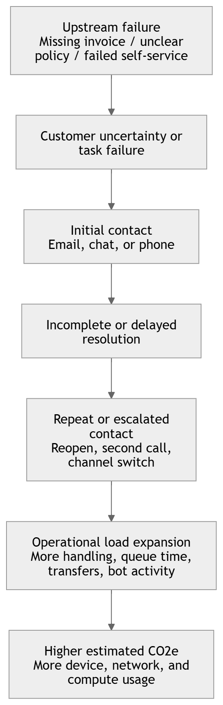

# CO2  emissions for a Customer Service

## An Operational Whitepaper on Estimating Emissions Across Calls, Email, Bots, and Avoidable Demand

## Executive Summary

Customer service organizations already measure volume, efficiency, quality, and workforce utilization in great detail. What is usually missing is a defensible way to estimate the carbon impact of those same operations without resorting to simplistic claims such as fixed grams of CO2 per email or per call.

This whitepaper proposes an activity-based approach to estimating the operational CO2 impact of customer service. Instead of treating service interactions as abstract digital events, the model links emissions estimates to measurable operational drivers such as agent handling time, customer device time, network traffic, cloud usage, bot activity, and repeat contact behavior.

The central argument is straightforward: customer service emissions should be analyzed as an operational system, not as a set of isolated channel averages. The most important strategic question is not whether one channel is always greener than another. The more useful question is where avoidable demand, poor resolution quality, routing inefficiency, and failed automation create unnecessary digital load.

This approach supports four practical outcomes:

- estimating operational CO2 impact using existing service data
- comparing channels and workflows using transparent assumptions
- identifying avoidable emissions caused by repeat contacts, reopens, queue time, and failed handovers
- connecting carbon impact to root causes, staffing structure, and service design decisions

The methodology is intended for operational analytics, baseline comparison, and improvement programs. It is not a certified greenhouse gas accounting method and should not be used on its own for formal regulatory or financial reporting.

## 1. Why Customer Service Needs a CO2 Model

Customer service has become a dense digital operating layer. A single case may involve a telephony platform, CRM workflows, agent desktops, customer smartphones, routing logic, knowledge systems, cloud storage, chatbot inference, and repeated follow-up interactions. Yet most organizations still evaluate this environment only through cost and service-performance metrics.

That creates a blind spot. Service leaders can usually see handle time, queue time, transfer rate, reopen rate, and bot containment. They often cannot see how these same variables contribute to digital energy use and estimated CO2 impact.

This matters for three reasons.

First, customer service contains a large amount of avoidable activity. Repeat calls, reopened email cases, callback retries, long queue times, failed authentication journeys, and bot-to-human handovers all increase operational load without creating proportional customer value.

Second, sustainability discussions often fail at the operational level because they remain too abstract. Service teams do not act on generic statements such as "digital activity creates emissions." They act on metrics tied to real workflows.

Third, automation is often discussed as inherently efficient, even though its impact depends on design quality. A chatbot that resolves a case in a few turns may reduce total impact. A bot that fails, hands over late, and forces the customer into a second channel may increase it.

The operational challenge is therefore not to label channels as good or bad. It is to identify which service patterns create unnecessary digital intensity and which improvements reduce both friction and estimated emissions.

## 2. Core Thesis

The core thesis of this whitepaper is:

`Customer service CO2 should be modeled as an estimated operational footprint derived from measurable service activity, configurable energy assumptions, and explicit reporting boundaries.`

This thesis leads to five design principles.

### 2.1 Activity-based, not slogan-based

The model should derive emissions from energy-related drivers such as device time, network use, cloud usage, and bot inference. It should not depend on opaque universal claims such as "one email always equals x grams of CO2."

### 2.2 Operationally embedded

CO2 should appear next to standard customer service metrics, not as a separate sustainability layer detached from operations. The point is to support decisions service leaders already make.

### 2.3 Boundary-aware

Different reporting views should remain explicit. A provider-side operational footprint is different from a broader interaction footprint that includes customer-side device and network assumptions.

### 2.4 Assumption-transparent

Every estimate should be explainable. Grid factors, device power assumptions, network energy intensity, attachment sizes, and LLM energy values should be documented, versioned, and configurable.

### 2.5 Root-cause oriented

The strongest strategic value does not come from channel comparison alone. It comes from showing which contact drivers are preventable and which teams, queues, or channels absorb avoidable demand.

## 3. Reporting Boundaries

Any serious customer service CO2 model should distinguish at least two reporting views.

### 3.1 Provider-side footprint

This view includes only the service organization's own operational layer:

- agent workstation energy
- provider-side software and cloud usage
- provider-side telephony and network usage
- chatbot or AI inference attributable to the service operation

This is usually the most commercially defensible reporting boundary because it focuses on operational elements the provider can influence directly.

### 3.2 Interaction footprint

This broader view includes provider-side factors plus selected customer-side assumptions:

- customer device time
- customer network traffic
- waiting or reading time associated with the service interaction

This view is useful when the objective is to understand avoided digital load across the full interaction rather than only the provider-side operation.

The key requirement is consistency. Reports should always state which boundary is used.

## 4. Modeling Logic

The recommended calculation logic is:

`CO2e = electricity use (kWh) x carbon intensity of electricity (kg CO2e / kWh)`

This is simple, but the strength of the model depends on how electricity use is estimated. For customer service, electricity use should be derived from the operational components that make up an interaction.

This framing is consistent with mainstream greenhouse-gas accounting logic. GHG Protocol guidance treats emissions estimation as the combination of `activity data` and appropriate `emission factors`, with preference for more specific values where available. For purchased electricity, Scope 2 guidance further reinforces the need for transparent treatment of electricity-related emissions and data sources. For ICT-heavy environments, ITU-T Recommendation L.1420 provides a methodological basis for assessing energy consumption and greenhouse-gas impacts of information and communication technologies in organizations.

### 4.1 Main energy drivers

The model can combine four primary drivers:

- agent device time
- customer device time
- network traffic
- cloud, SaaS, bot, or AI compute usage

### 4.2 Example assumptions for an MVP

Illustrative assumptions may include:

- agent laptop active: `40 W`
- agent desktop and monitor active: `90 W`
- customer smartphone active: `5 W`
- customer laptop active: `30 W`
- fixed network intensity: `0.29 kWh / GB`
- mobile network intensity: `0.60 kWh / GB`
- LLM query estimate: about `0.0003 kWh` for a typical short query

These values are not universal truths. They should be configurable by customer, geography, infrastructure, and use case.

In practice, electricity carbon factors should be region-specific wherever possible. For example, the U.S. EPA's eGRID references provide national and regional electricity emission factors, while the German Umweltbundesamt publishes annual factors for the German electricity mix. This is especially important for customer service operations spanning multiple countries or cloud regions.

### 4.3 Why time matters more than message mythology

In many service workflows, the largest contributor is not the transmission of a message but the time spent by humans and systems handling it. A reopened email case, for example, is often more meaningfully explained by extra agent handling and extra customer reading time than by the raw bytes of the message itself.

That is why an activity-based model is more useful than a fixed "grams per email" heuristic. It exposes where operational friction actually sits.

## 5. Channel Logic

The same modeling framework can be applied across the main customer service channels.

### 5.1 Calls

Call-related impact is typically driven by:

- talk time
- queue time
- hold time
- after-call work
- callback attempts
- transfer and escalation loops
- customer network type and device assumptions

Illustrative provider-side call formula:

`call_kWh_provider = agent_device_kW x handle_minutes / 60 + provider_network_kWh_per_min x handle_minutes`

This allows teams to quantify not only total call-related impact, but also the avoidable portion associated with long handle time, failed callbacks, or repeated contacts.

### 5.2 Email

Email support is often underestimated because the raw transmission footprint of a simple message can be small. In practice, impact is often dominated by:

- agent handling time
- reopened threads
- duplicate contacts
- attachment-heavy workflows
- retention and storage where measured

Illustrative provider-side email formula:

`email_kWh_provider = agent_device_kW x handling_minutes / 60 + network_intensity x email_data_GB`

This makes reopen rate and reply-chain complexity visible as operational emissions drivers rather than merely quality metrics.

### 5.3 Chatbots

Chatbots should not be framed as automatically sustainable. Their impact depends on:

- turns per session
- session duration
- customer device time
- LLM energy per turn where relevant
- escalation rate to human service
- avoided downstream interaction volume

Illustrative LLM chatbot formula:

`bot_kWh_llm = turns x llm_kWh_per_turn + customer_device_kW x session_minutes / 60 + text_network_kWh`

The most important metric is not bot footprint in isolation. It is net savings relative to the human workflow the bot actually replaces.

### 5.4 Voice bots

Voice bots can reduce human handling load, but they can also create retry loops, recognition failures, and expensive late-stage transfers. A useful model therefore tracks:

- voice bot duration
- retry loops
- ASR and TTS usage
- LLM turns if enabled
- transfer to human agents
- callback scheduling outcomes

### 5.5 Hybrid journeys

Many customer issues are not channel-pure. A failed chatbot may lead to a call. A call may trigger a follow-up email. A voice bot may fail authentication and create a callback attempt. A realistic model should therefore support multi-step case logic and show the added impact of channel switching.

## 6. The Real Lever: Avoidable Demand

Channel comparison is useful, but it is not the deepest strategic layer. The strongest improvement lever in customer service is often avoidable demand.

Avoidable demand is created when customers contact support because something in the upstream journey is broken, unclear, delayed, duplicated, or preventable. Examples include:

- invoice not received
- where-is-my-order requests
- password reset friction
- duplicate document requests
- policy confusion
- failed self-service

### 6.1 Avoidable Demand as a Causal Chain

Avoidable demand should not be treated as an isolated contact label. It is better understood as a causal chain that links an upstream service failure to downstream operational load and estimated emissions.

*Illustrative causal chain showing how upstream service failures create downstream operational load and estimated emissions.*

A typical avoidable-demand chain may look like this:

- upstream failure: a customer does not receive an invoice, shipping update, password reset, or policy clarification at the right time or in a usable format
- customer uncertainty or task failure: the customer cannot complete the intended action, cannot verify status, or loses confidence in the self-service path
- contact creation: the customer initiates contact through email, chat, or phone
- channel escalation or duplication: if the first interaction does not resolve the issue, the customer retries in another channel, reopens the case, or calls again
- operational load expansion: additional queue time, handling time, transfers, callbacks, bot sessions, and follow-up messages are generated
- estimated emissions increase: device time, network usage, software processing, and bot or cloud activity all rise as a result of the avoidable interaction chain

This logic is strategically important because the emissions effect is usually downstream of a preventable design problem. The operational footprint does not begin with the call or email. It begins earlier, in a broken information flow, unclear policy, delayed communication, weak self-service design, or failed automation step.

For that reason, avoidable demand should be modeled not only as an interaction outcome, but also as a root-cause category. A useful analytical structure is:

- root cause: what failed upstream
- contact trigger: why the customer contacted support
- service path: which channels and teams handled the issue
- resolution outcome: resolved, reopened, transferred, duplicated
- estimated CO2e impact: total and avoidable share

This makes it possible to move from descriptive reporting to causal management. Instead of asking only which channel generated the most estimated emissions, organizations can ask which upstream failures generated the most avoidable operational load.

When these contacts occur in expensive channels such as calls or specialist queues, the operational and carbon cost rises further.

This is why the CO2 model should include a contact-driver taxonomy with at least:

- source driver label
- normalized driver group
- preventability flag

This structure enables a more useful set of questions:

- Which driver groups generate the most estimated CO2e?
- Which of them are preventable?
- Which teams absorb that avoidable load?
- Which channels are overused for the same issue type?

At that point, customer service CO2 becomes a root-cause management system rather than a channel scorecard.

## 7. Workforce Structure Matters

Most service organizations do not operate with one team per channel and one agent per workflow. They operate with blended staffing, fluctuating allocation, queue-based routing, and specialist escalation paths.

That means service intensity is shaped not only by contact volume, but also by workforce structure:

- active agent count
- productive hours
- occupancy
- staffing mix by channel
- queue design
- skill-group allocation

Two teams with similar contact volumes may therefore have very different impact profiles. One may resolve straightforward cases efficiently in low-friction channels. Another may absorb high-cost, preventable, or repeatedly escalated demand.

For this reason, the model should support workforce metrics such as:

- CO2e per agent
- CO2e per productive hour
- contacts per agent
- driver-group CO2 by team

This turns the whitepaper's argument into an operating model: emissions are not just a function of channel choice, but of how the organization is staffed and where demand is routed.

## 8. KPI Design for a Practical Dashboard

For adoption, the dashboard should look like a standard customer service reporting environment with a parallel CO2 layer.

The recommended structure is:

1. Volume
2. Efficiency
3. Quality and Resolution
4. CO2 Impact

Examples of practical KPI pairings include:

- `AHT` with `estimated CO2e per call`
- `Reopen rate` with `estimated CO2e from reopened cases`
- `Bot containment` with `estimated avoided CO2e vs human-only handling`
- `Queue time` with `estimated CO2e from waiting and telephony load`
- `Preventable contact rate` with `estimated CO2e from avoidable demand`

This design principle matters because service leaders do not manage emissions as an isolated system. They manage service outcomes. The CO2 layer becomes useful only when it explains or strengthens operational decisions already on the table.

## 9. Illustrative Use Cases

The methodology supports a set of concrete use cases that are easy to explain to service and sustainability stakeholders.

### 9.1 Lower average handle time for calls

Reducing one minute of handle time lowers agent device usage, provider network usage, and often customer-side interaction time as well. At scale, small operational improvements can create meaningful monthly savings.

### 9.2 Lower email reopen rate

A reopened case adds new handling time, additional customer reading time, and extra message traffic. Better first-time resolution can therefore reduce both workload and estimated impact.

### 9.3 Reduce unnecessary email volume

If policy clarification, better self-service, or cleaner order communication prevents large volumes of low-value service emails, the cumulative savings become significant even where individual email events are small.

### 9.4 Use chatbots for effective deflection

A chatbot can reduce total impact if it resolves issues quickly and actually replaces a more resource-intensive human workflow. It can increase total impact if it fails late and adds a second interaction instead of replacing one.

### 9.5 Fix upstream drivers instead of optimizing downstream handling

The biggest sustainability gain may not come from making support operations marginally more efficient. It may come from removing preventable contact causes in billing, shipping, identity, product communication, or policy design.

### 9.6 Illustrative Worked Example

A service team handling 100,000 calls per month with an average total handling profile of 7.5 minutes per call generates a measurable operational footprint even under conservative assumptions. If agent workstation energy is modeled at 0.09 kW, platform and telephony load at 0.0015 kWh per call-minute, and electricity carbon intensity at 0.35 kg CO2e per kWh, the estimated provider-side footprint is approximately 7.9 g CO2e per call, or 787.5 kg CO2e per month.

If 12 percent of this volume is avoidable repeat demand, then approximately 94.5 kg CO2e per month is associated with preventable call activity alone. If average total handling time is reduced from 7.5 to 6.5 minutes, the estimated monthly footprint falls to 682.5 kg CO2e, a reduction of 105 kg CO2e per month without any change in channel mix. This illustrates the core operational point: the most important lever is often not the channel itself, but the reduction of avoidable service intensity.

## 10. Data Model and Implementation Approach

A practical implementation should use a canonical customer service model rather than hard-coding one vendor's semantics. However, the data model should remain subordinate to the carbon-accounting logic. The purpose of the model is to capture the operational activity data needed for defensible emissions estimation.

In other words, the data model should exist because the methodology requires structured activity data, not because a software platform prefers a certain schema shape. The minimum modeling requirement is to preserve the operational facts needed to combine:

- measurable service activity
- electricity or energy-related assumptions
- emissions factors
- reporting boundary choices
- confidence and provenance metadata

That is the point where customer service data architecture becomes carbon-footprint infrastructure.

The model should support entities such as:

- case
- interaction
- call interaction
- email interaction
- chatbot session
- voice bot session
- attachment
- callback
- transfer
- escalation
- agent activity
- contact driver
- assumption set

From a carbon-footprint perspective, the most important design requirement is that the model preserves auditable links between raw operational records and derived emissions outputs. A call record should be traceable to duration, queue time, device assumptions, electricity factor, and calculation version. An email case should be traceable to handling time, attachment assumptions, and reopen logic. A bot session should be traceable to turn count, session duration, model class assumptions, and deflected downstream workload.

This supports three adoption paths.

### 10.1 CSV-first

Useful for pilots, fragmented environments, and non-engineering teams. The objective is to prove the metric logic with existing exports.

### 10.2 Event-level ingestion

Useful for more accurate queue, retry, callback, and handover modeling.

### 10.3 Warehouse-first

Useful for larger organizations with central analytics teams and multiple service platforms.

Across all paths, the principle should remain the same: map source data into a canonical structure, apply versioned assumptions, compute service and CO2 KPIs, and label outputs with confidence levels.

This architecture aligns with the general logic used in carbon accounting and ICT-impact assessment:

- `GHG Protocol`: collect activity data and apply documented emission factors
- `Scope 2 Guidance`: use transparent electricity-emissions treatment for purchased electricity
- `ITU-T L.1420`: assess ICT-related energy use and greenhouse-gas impacts in organizational settings
- `EPA eGRID` and national government factors such as `UBA`: prefer regionally appropriate electricity factors over generic global defaults
- `IEA Energy and AI`: recognize that digital services and AI-related compute are tied to growing electricity demand and should therefore be modeled with explicit energy assumptions rather than treated as impact-free abstractions

## 11. Confidence and Governance

Not every metric will have the same evidentiary strength. A serious implementation should therefore classify outputs by confidence.

### High confidence examples

- measured call duration
- measured queue time
- measured email counts
- measured reopen counts
- measured bot turns
- known regional grid factor

### Medium confidence examples

- device power assumptions
- network intensity assumptions
- customer device mix
- typical audio bitrate assumptions

### Lower confidence examples

- inferred customer reading time
- generalized storage assumptions
- generic public emissions shortcuts with weak provenance

The governance principle is simple: measured values should remain distinct from assumed values, and assumptions should be visible, configurable, and auditable.

## 12. What This Whitepaper Does Not Claim

This whitepaper does not claim that customer service emissions can be measured with perfect precision from standard operational data. It does not claim that one channel is always better than another in every context. It does not claim that the methodology replaces a corporate greenhouse gas inventory.

The correct claim is narrower and stronger:

`Customer service operations can be modeled as an estimated operational CO2 system using documented assumptions and service data, allowing organizations to compare workflows, identify avoidable load, and track improvement over time.`

That level of claim is both more defensible and more useful.

## 13. Strategic Implications

The operationalization of customer service CO2 has implications beyond reporting.

It changes how organizations think about:

- automation quality
- self-service design
- queue and routing strategy
- root-cause elimination
- staffing intensity
- customer friction as a sustainability issue

Once emissions are linked to repeatable operational patterns, sustainability stops being a detached ESG narrative and becomes part of service design and continuous improvement.

This is the real opportunity. The purpose is not to produce a greener-looking dashboard. The purpose is to reveal where customer service creates avoidable digital load and where better resolution design lowers cost, friction, and estimated impact at the same time.

## 14. Conclusion

Customer service is an ideal domain for operational carbon estimation because it already produces rich performance data, clear workflow semantics, and measurable improvement levers. The missing piece is a transparent model that converts service activity into estimated CO2 impact without hiding behind simplistic averages or overstated claims.

An activity-based framework provides that missing layer. It allows organizations to estimate impact across calls, email, chatbots, voice bots, and case handling. More importantly, it helps them identify the structural causes of unnecessary digital load: repeat contacts, failed automation, queue inflation, reopen loops, and preventable demand.

That is why customer service CO2 should be treated not as a sustainability side project, but as an extension of mainstream service operations management.

## References

- GHG Protocol. `Calculation Tools FAQ`. Explains the use of activity data and emission factors in greenhouse-gas estimation. https://ghgprotocol.org/calculation-tools-faq
- GHG Protocol. `Scope 2 Guidance`. Standardizes accounting for emissions from purchased electricity, steam, heat, and cooling. https://ghgprotocol.org/scope-2-guidance
- U.S. Environmental Protection Agency. `Greenhouse Gas Equivalencies Calculator: Calculations and References`. Includes U.S. eGRID-based electricity emission factors and calculation logic. https://www.epa.gov/energy/greenhouse-gas-equivalencies-calculator-calculations-and-references
- Umweltbundesamt. `CO2-Emissionen pro Kilowattstunde Strom 2024 gesunken`, published April 9, 2025. Provides Germany's 2024 electricity-mix factor and methodological context. https://www.umweltbundesamt.de/themen/co2-emissionen-pro-kilowattstunde-strom-2024
- Umweltbundesamt. `Entwicklung der spezifischen Treibhausgas-Emissionen des deutschen Strommix in den Jahren 1990 - 2024`, published April 2025. Methodological publication on German electricity-mix emission factors. https://www.umweltbundesamt.de/publikationen/entwicklung-der-spezifischen-treibhausgas-11
- International Energy Agency. `Energy and AI: Executive Summary`. Provides current context on data-centre electricity demand and AI-related energy growth. https://www.iea.org/reports/energy-and-ai/executive-summary
- International Telecommunication Union. `ITU-T Recommendation L.1420: Methodology for energy consumption and greenhouse gas emissions impact assessment of information and communication technologies in organizations`. https://www.itu.int/rec/T-REC-L.1420

## Disclaimer

This whitepaper describes an activity-based framework for estimating the operational CO2 impact of customer service workflows. Results depend on reporting boundaries, source data quality, and configurable assumptions such as electricity carbon intensity, device power, network energy intensity, and AI energy per turn. The methodology is intended for operational analytics, benchmarking, and improvement analysis. It is not a certified emissions accounting method and should not be used as a standalone basis for formal regulatory or financial carbon reporting.
